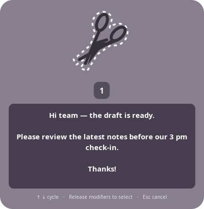
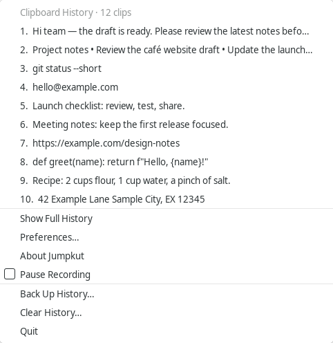
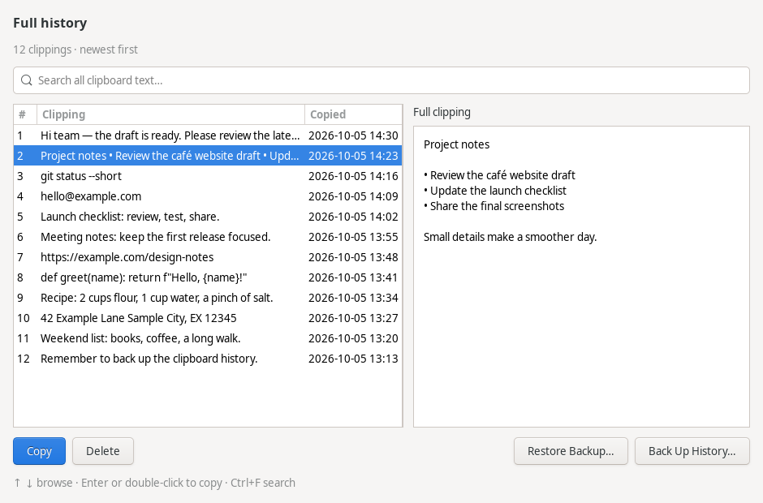
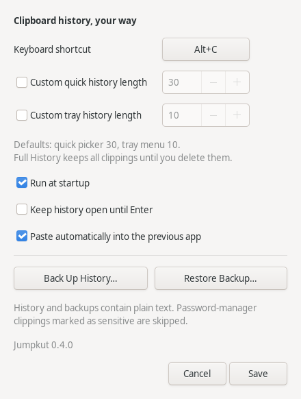
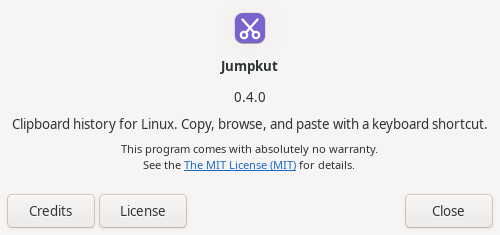

<p align="center">
  
</p>

<p align="center">
  <a href="https://github.com/patrick-hudson/jumpkut/actions/workflows/tests.yml"></a>
  <a href="https://github.com/patrick-hudson/jumpkut/actions/workflows/packages.yml"></a>
  <a href="https://github.com/patrick-hudson/jumpkut/releases/latest"></a>
  <a href="LICENSE"></a>
  
  
</p>

<p align="center">
  <strong>A small, keyboard-first clipboard manager for Linux.</strong><br>
  Copy text. Press <strong>Alt+C</strong>. Find the clipping you need. Keep moving.
</p>

<p align="center">
  <a href="#installation">Install</a> ·
  <a href="#how-it-works">How it works</a> ·
  <a href="#screenshots">Screenshots</a> ·
  <a href="#preferences">Preferences</a> ·
  <a href="CHANGELOG.md">Changelog</a>
</p>

Jumpkut brings the quick, single-clipping picker of [Jumpcut](https://snark.github.io/jumpcut/) to Linux, with a scissors tray icon, a searchable history browser, and portable backups. It is a native GTK 3 app written in Python.

**Requires an X11 desktop session.** Native Wayland is not supported. Jumpkut records text, including Unicode and multiline content; images and files are not recorded.

## How it works

1. **Copy** text in any app. Jumpkut saves it in the background.
2. **Press Alt+C** and keep Alt held. The picker starts at the newest clipping, **#1**.
3. **Browse with ↑ / ↓** or press **C** again to cycle.
4. **Release Alt** to select and paste into your previous app. **Esc** cancels.

Prefer to choose without holding a key? Enable **Keep history open until Enter** in Preferences.

| A place for every clipping | What you get |
|---|---|
| **Quick picker** | A Jumpcut-style bezel with one preview at a time; the newest **30** clippings by default. |
| **System tray** | The newest **10** clippings, plus Full History, Preferences, Pause Recording, backups, and Quit. |
| **Full History** | Every saved clipping, with search, full previews, copying, and deletion. |
| **Your preferences** | A configurable shortcut, independent optional quick/tray limits, startup, and paste behavior. |
| **Backups** | Export the complete archive to JSON; restore and merge without losing existing clippings. |
| **Background launch** | One `jumpkut` command, a desktop app-menu entry, and optional startup at login. |

## Screenshots

These are real screenshots of Jumpkut **0.4.0**, using demo clippings.

<table>
  <tr>
    <td align="center" width="50%"><strong>Quick picker</strong><br><br></td>
    <td align="center" width="50%"><strong>System tray</strong><br><br></td>
  </tr>
</table>

<p align="center"><strong>Full History — search, read, copy, and organize the complete archive</strong></p>
<p align="center"></p>

<table>
  <tr>
    <td align="center" width="50%"><strong>Preferences & backups</strong><br><br></td>
    <td align="center" width="50%"><strong>Version information</strong><br><br></td>
  </tr>
</table>

## Installation

Download an installer from **[the latest release](https://github.com/patrick-hudson/jumpkut/releases/latest)**. All formats require an **X11 session** and support the same clipboard history, preferences, and backups.

| Format | Use it on | What is included |
|---|---|---|
| **.deb** | Linux Mint, Ubuntu, Debian with Python 3.10+ | System-wide command, application-menu entry, and scissors icon; apt installs dependencies. |
| **.rpm** | Fedora with Python 3.10+ | System-wide command, application-menu entry, and scissors icon; dnf installs dependencies. |
| **.AppImage** | x86_64 Linux with glibc 2.35+ | Portable bundle containing Python, GTK, and the application's dependencies. |

### Debian, Ubuntu & Linux Mint

From the directory containing your downloaded `.deb`:

```sh
sudo apt install ./jumpkut_*_all.deb
jumpkut
```

### Fedora

From the directory containing your downloaded `.rpm`:

```sh
sudo dnf install ./jumpkut-*.noarch.rpm
jumpkut
```

Both native packages add **Jumpkut** to your desktop's application menu. Open it there to browse Full History. Installing a later package updates the app and preserves your saved history and preferences.

### Portable AppImage

Save the AppImage somewhere permanent, such as `~/Applications`, then make it executable and run it:

```sh
chmod +x Jumpkut-*-x86_64.AppImage
./Jumpkut-*-x86_64.AppImage
```

It starts in the background. Append `--history` to open Full History or `--preferences` to configure it. Enable **Run at startup** after placing the file in its permanent location. If you move or rename the AppImage, disable and re-enable startup from its new location.

If your desktop cannot mount AppImages with FUSE, use the runtime's extraction mode:

```sh
APPIMAGE_EXTRACT_AND_RUN=1 ./Jumpkut-*-x86_64.AppImage
```

Release downloads include **SHA256SUMS**. Put it beside the downloaded packages and run `sha256sum --check --ignore-missing SHA256SUMS` to verify them. Source `.zip` and `.tar.gz` archives are also available on each release page.

### Install from source

On Linux Mint, Ubuntu, or Debian, install the system dependencies, then clone and install Jumpkut for your user:

```sh
sudo apt install git python3-gi gir1.2-gtk-3.0 python3-xlib librsvg2-common
git clone https://github.com/patrick-hudson/jumpkut.git
cd jumpkut
./install.py
jumpkut
```

Python **3.10 or newer** is required. Only the dependency installation needs `sudo`; run the Jumpkut installer as your normal user.

Plain `jumpkut` starts in the **background** and returns immediately. The app stays in the tray after you close the terminal. You can also open **Jumpkut** from your desktop's application menu to show Full History.

If your shell cannot find the command, add the user bin directory to your shell's PATH:

```sh
export PATH="$HOME/.local/bin:$PATH"
```

Add that line to your shell's startup file to keep it across terminals. Enable **Run at startup** in Preferences to start Jumpkut when you sign in.

Linux Mint Cinnamon supports the tray protocol Jumpkut uses. Other desktops need support for legacy tray icons; GNOME may need a tray extension.

<details>
<summary><strong>Installation paths and running from source</strong></summary>

The installer creates:

| Item | Location |
|---|---|
| Command | `~/.local/bin/jumpkut` |
| Application | `~/.local/share/jumpkut/app/` |
| App-menu entry | `~/.local/share/applications/jumpkut.desktop` |
| Scissors icon | `~/.local/share/icons/hicolor/scalable/apps/jumpkut.svg` |

Use `./install.py --prefix /some/directory` for a custom installation base. You can run from a source checkout with `./run.py` without installing the launcher.

</details>

## Keyboard controls

| In the quick picker | Action |
|---|---|
| **Alt+C** | Open at the newest clipping; repeated C cycles while Alt is held. |
| **↑ / ↓** | Browse recent clippings. |
| **Release Alt** | Select and automatically paste, with default preferences. |
| **Enter** | Select in sticky mode or when opened with `--show`. |
| **Home / End** | Jump to the newest / oldest clipping in the picker. |
| **Delete** | Delete the selected clipping from saved history. |
| **Esc** | Cancel. |

In **Full History**, use arrows and Page Up / Page Down to browse, **Enter** or double-click to copy, and **Ctrl+F** to search. Copying leaves the browser open and preserves history order; paste into your other app when ready.

Automatic paste uses Ctrl+V, or Ctrl+Shift+V for recognized terminal windows. You can disable it in Preferences and paste the selected clipboard text yourself.

## Preferences

Click the scissors tray icon and choose **Preferences**.

| Setting | Default | Customize it |
|---|---|---|
| Keyboard shortcut | **Alt+C** | Click the shortcut button and press a new combination. |
| Quick picker length | **30** | Check **Custom quick history length**, then choose 1–10,000. |
| Tray menu length | **10** | Check **Custom tray history length**, then choose 1–10,000. |
| Full History | **All saved clippings** | Delete individual entries or use Clear History. |
| Run at startup | **Off** | Enable it to start at login. |
| Automatic paste | **On** | Disable it to copy selections without pasting. |
| Keep picker open until Enter | **Off** | Enable it to choose after releasing the shortcut. |

The two custom-length checkboxes start unchecked. Unchecking one restores that view's default and remembers its custom value for later. **Changing either limit never removes older clippings from Full History.**

A shortcut already in use produces an error. Changes take effect when you save.

## History & backups

Use **Back Up History…** in the tray, Preferences, or Full History to export the complete archive to a portable JSON file. **Restore Backup…** merges a backup with your existing archive, removes duplicate text, and retains older entries beyond the quick and tray limits.

History keeps all unique clippings until you delete them or clear it. Repeated copies move an existing clipping to the front. Exact whitespace and text are preserved; empty or whitespace-only copies are ignored.

History and backups contain **plain text**. Clippings explicitly marked sensitive by supported password managers are skipped; ordinary clipboard text is stored as copied.

| Saved data | Default location |
|---|---|
| Preferences | `~/.config/jumpkut/config.json` |
| History | `~/.local/share/jumpkut/history.json` |
| Startup entry | `~/.config/autostart/jumpkut.desktop` |
| Background log | `~/.local/state/jumpkut/jumpkut.log` |

Jumpkut respects `XDG_CONFIG_HOME`, `XDG_DATA_HOME`, and `XDG_STATE_HOME`. Clearing history keeps exported backups and leaves the current system clipboard unchanged.

## Commands

```sh
jumpkut                # Start in the background
jumpkut --show         # Open the quick picker
jumpkut --history      # Open Full History
jumpkut --preferences  # Open Preferences
jumpkut --about        # Show version and credits
jumpkut --quit         # Quit the running instance
jumpkut --version      # Print the installed version
jumpkut --daemon       # Run attached to the terminal for debugging
```

`--background` explicitly selects the default background behavior. One instance runs per desktop session; commands are forwarded to it.

## Updating

For `.deb` and `.rpm` installations, quit the running app, install the newer downloaded package with the command above, and start Jumpkut again. For AppImage, quit the app, replace the old file, and run the new one. Re-enable startup if its filename changed. Saved history and preferences live in your XDG directories and are shared between installation formats.

If you previously used `./install.py`, its `~/.local/bin/jumpkut` command and `~/.local/share/applications/jumpkut.desktop` menu entry may take precedence over the native package. Quit the old app, rename those two files, and start `/usr/bin/jumpkut`. Then disable and re-enable **Run at startup** in the new app. This does not require removing any saved history.

From your source checkout:

```sh
git pull --ff-only
./install.py
jumpkut --quit
jumpkut
```

Reinstalling preserves saved history, preferences, and backups. Restart a running instance after updating so it loads the new code. Standard installs persist history to disk; if you disabled persistence in the configuration file, back up the in-memory history before quitting.

Older preferences using the previous default of 200 move to the new 30/10 defaults. A saved quick length of 30 uses the unchecked default; other custom quick lengths stay enabled. Entries removed by an older release can be recovered only from a backup containing them.

## Development

Use the system Python so GTK and PyGObject are available:

```sh
/usr/bin/python3 -m unittest discover -s tests -v
```

Run the native desktop integration tests separately:

```sh
sudo apt install xvfb metacity dbus-x11
./scripts/test-desktop.sh
```

The native runner uses a disposable X11 display, a private session bus, and temporary history and preferences. It does not use your live clipboard. GitHub Actions runs both suites.

The **[Linux packages workflow](https://github.com/patrick-hudson/jumpkut/actions/workflows/packages.yml)** builds all three packages on pushes and pull requests; you can also run it manually. CI tests the native package and AppImage after packaging, then saves the files as an Actions artifact. Pushing a matching `vX.Y.Z` tag publishes the tested installers and checksums as a GitHub release.

Read [CONTRIBUTING.md](CONTRIBUTING.md) for development and releases, [CHANGELOG.md](CHANGELOG.md) for release notes, and [validation notes](docs/validation.md) for test coverage.

## License & credits

[MIT](LICENSE). Inspired by [Jumpcut](https://snark.github.io/jumpcut/) for macOS. Jumpkut is an independent project and uses its own GTK interface, clipboard implementation, and scissors artwork.
